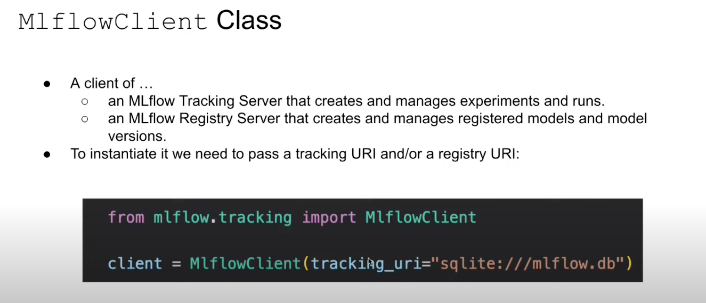
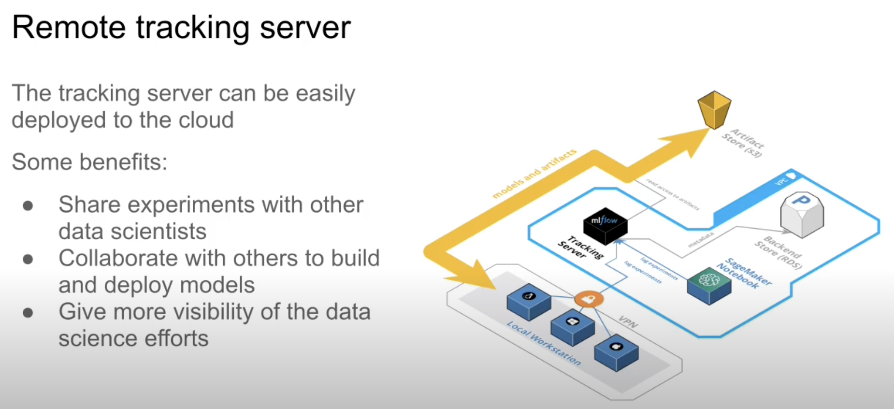

# Experiment Tracking

## 2.1 Experiment tracking intro

## 2.2 Getting started with MLflow
- Launch MLflow UI with a Backend Store:

`
mlflow ui --backend-store-uri sqlite:///mlflow.db
`

- Setup MLflow experiment tracking

`
import mlflow
mlflow.set_tracking_uri("sqlite:///mlflow.db")
mlflow.set_experiment("nyc-taxi-experiment")
`

- Log the predications, show in MLflows UI

## 2.3 Experiment tracking with MLflow
- Add parameter tuning: hyperopt library

- show how it looks in MLflow

- Select the best hyper parameter combination

- autolog

## 2.4 Model management

- the ML workflow lifecycle

- two ways to save the model in mlflow

- load the models stored in mlflow
    - Way 1: load model as a function that can directlly call
    - Way 2: load model as xhboost model

## 2.5 Model registry
- model registry

These model are production ready

- MLflow client

## 2.6 MLflow in Practice
- Configuring MLflow

- Remote tracking server

- Issues
