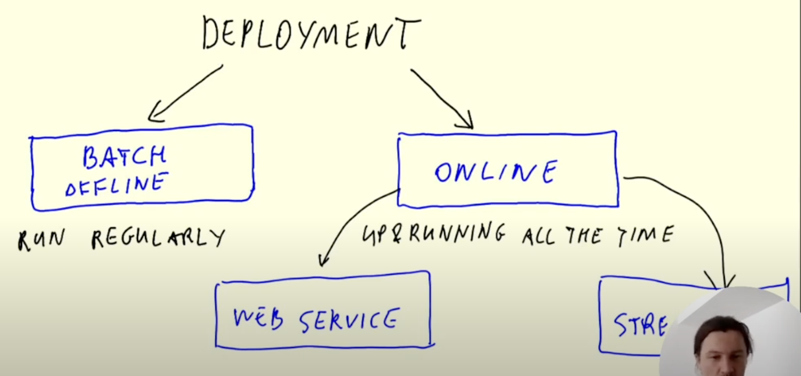
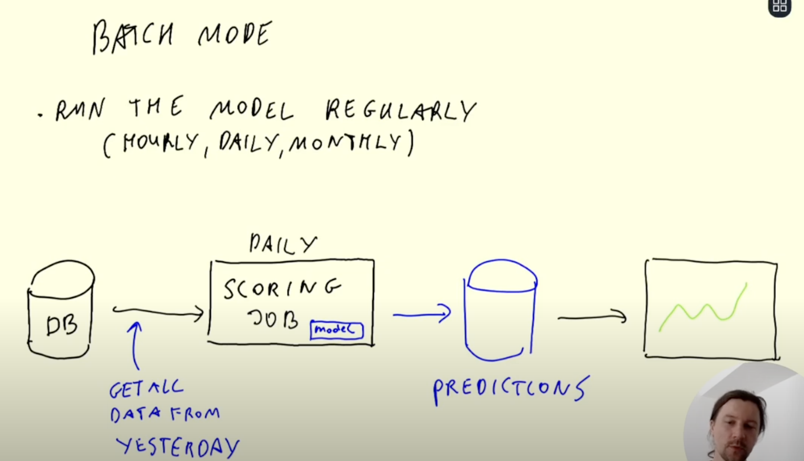
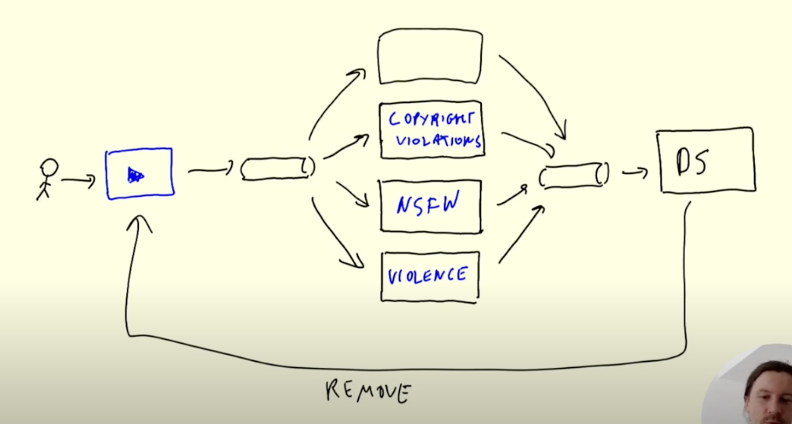
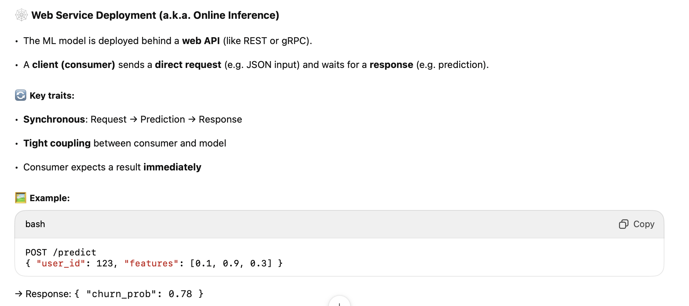
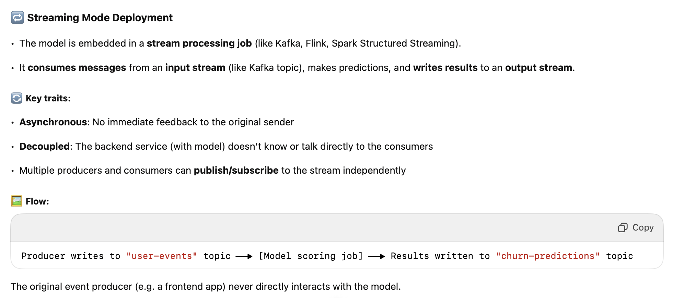
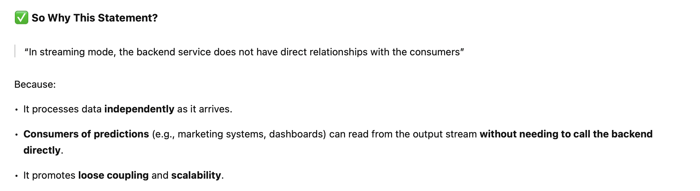
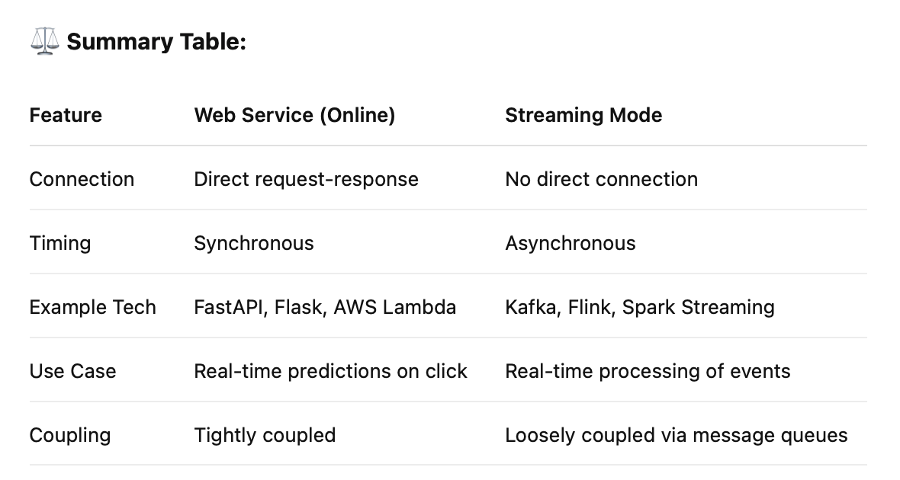
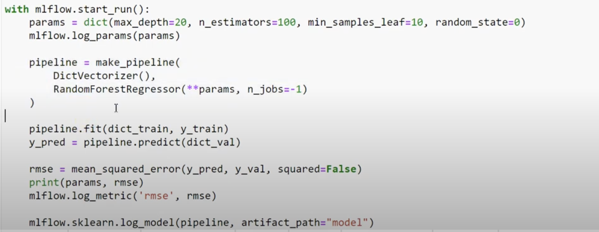
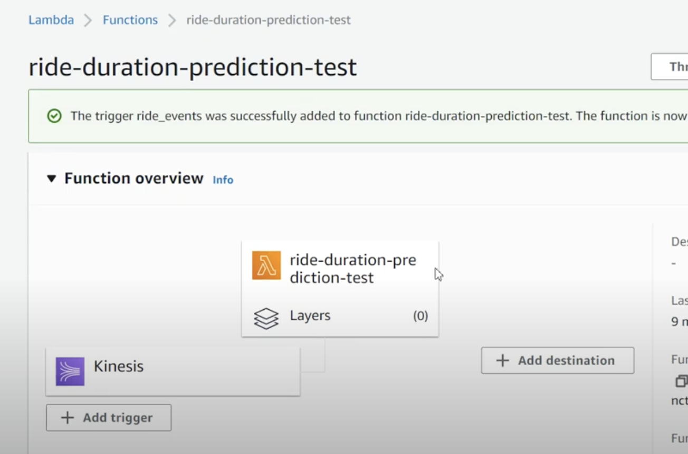
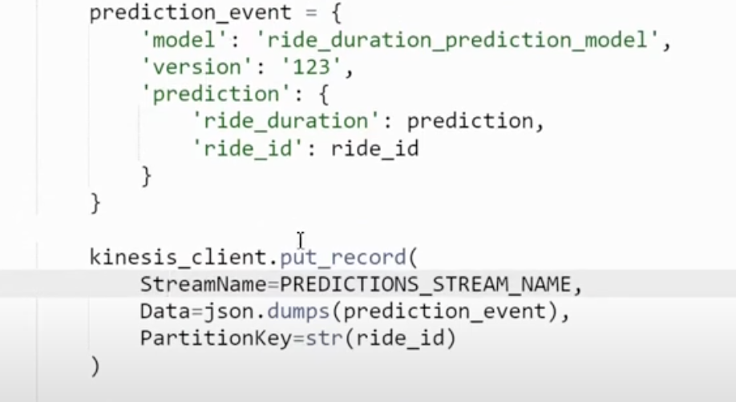

# 4.1 Three ways of deployment a model



- Batch model


- Web service
1-1 client - server relationship

- Streaming
1-N producer - consumers relationship

example: youtube reviewing system








# 4.2 Web-services: Deploying models with Flask and Docker

## background tool intro
- [Flask intro](https://github.com/DataTalksClub/machine-learning-zoomcamp/blob/master/05-deployment/03-flask-intro.md)

## Deploying a model as a web-service
* Creating a virtual environment with Pipenv
* Creating a script for predicting
* Putting the script into a Flask app
* Packaging the app to Docker

```bash
pipenv install scikit-learn==1.0.2 flask --python=3.9
```

Avove command would using python3.9 to create virtual env, install scikit-learn, flask 

```bash
docker build -t ride-duration-prediction-service:v1 .
```

```bash
docker run -it --rm -p 9696:9696 ride-duration-prediction-service:v1
```

# 4.3 Web-services: Getting the models from the model registry (MLflow)
- the trained model is now stored in s3 and registered with MLFlow


- Model deployment with tracking server
  - Load the model
  - using MLFlow client to download the DictVectorizer

- To solve the two step load (model and dv)
  - Put the model into a scikit-learn pipeline, so after training process, it would be registered in MLflow together


- To solve the tracking server availability issue
  - Model deployment without the tracking server
  - directly load the model from s3

# 4.4 Machine Learning for Streaming
- Scenario: usually for better model/optimized cases, that need several service to work together. Read from a input message stream -> make predictions -> return results to the output stream

- Create the execution role (-> defines the permissions of the Lambda function)
- Creat a Lambda function
- Create and connect Kinesis data stream (input stream)

- send a test event to the stream

Test event
```json
{
    "Records": [
        {
            "kinesis": {
                "kinesisSchemaVersion": "1.0",
                "partitionKey": "1",
                "sequenceNumber": "49630081666084879290581185630324770398608704880802529282",
                "data": "ewogICAgICAgICJyaWRlIjogewogICAgICAgICAgICAiUFVMb2NhdGlvbklEIjogMTMwLAogICAgICAgICAgICAiRE9Mb2NhdGlvbklEIjogMjA1LAogICAgICAgICAgICAidHJpcF9kaXN0YW5jZSI6IDMuNjYKICAgICAgICB9LCAKICAgICAgICAicmlkZV9pZCI6IDI1NgogICAgfQ==",
                "approximateArrivalTimestamp": 1654161514.132
            },
            "eventSource": "aws:kinesis",
            "eventVersion": "1.0",
            "eventID": "shardId-000000000000:49630081666084879290581185630324770398608704880802529282",
            "eventName": "aws:kinesis:record",
            "invokeIdentityArn": "arn:aws:iam::XXXXXXXXX:role/lambda-kinesis-role",
            "awsRegion": "eu-west-1",
            "eventSourceARN": "arn:aws:kinesis:eu-west-1:XXXXXXXXX:stream/ride_events"
        }
    ]
}
```
- Create prediction Kinesis data stream (output stream)
- Add the write permission into execution role
- in Lambda: put record into output Kinesis data stream


```bash
KINESIS_STREAM_INPUT=ride_events
aws kinesis put-record \
    --stream-name ${KINESIS_STREAM_INPUT} \
    --partition-key 1 \
    --data "Hello, this is a test."
```

- Reading from the output stream
```bash
KINESIS_STREAM_OUTPUT='ride_predictions'
SHARD='shardId-000000000000'

SHARD_ITERATOR=$(aws kinesis \
    get-shard-iterator \
        --shard-id ${SHARD} \
        --shard-iterator-type TRIM_HORIZON \
        --stream-name ${KINESIS_STREAM_OUTPUT} \
        --query 'ShardIterator' \
)

RESULT=$(aws kinesis get-records --shard-iterator $SHARD_ITERATOR)

echo ${RESULT} | jq -r '.Records[0].Data' | base64 --decode
```

- Put everything to Docker

```bash
docker build -t stream-model-duration:v1 .

docker run -it --rm \
    -p 8080:8080 \
    -e PREDICTIONS_STREAM_NAME="ride_predictions" \
    -e RUN_ID="e1efc53e9bd149078b0c12aeaa6365df" \
    -e TEST_RUN="True" \
    -e AWS_DEFAULT_REGION="eu-west-1" \
    stream-model-duration:v1
```
To use AWS CLI, you many need to set the env variables about the AWS access key and secret access key.

Run docker image in local, and it would expose a port to listen to the request, send request to below URL for testing:
http://localhost:8080/2015-03-31/functions/function/invocations

- publish the built image to ECR(AWS Elastic Container Registry)

Creating an ECR repo
```bash
aws ecr create-repository --repository-name duration-model
```

Logging in
```BASH
$(aws ecr get-login --no-include-email)
```

PUSHING
```bash
REMOTE_URI="387546586013.dkr.ecr.eu-west-1.amazonaws.com/duration-model"
REMOTE_TAG="v1"
REMOTE_IMAGE=${REMOTE_URI}:${REMOTE_TAG}

LOCAL_IMAGE="stream-model-duration:v1"
docker tag ${LOCAL_IMAGE} ${REMOTE_IMAGE}
docker push ${REMOTE_IMAGE}
```

- Create another Lambda function from Container image (second option to use Lambda)

[Tutorial: Using Lambda with Kinesis Data Streams](https://docs.amazonaws.cn/en_us/lambda/latest/dg/with-kinesis-example.html)


### how to update pipfile and rebuild ve

removing virtualenv
```bash
pipenv --rm
```

removing pipfile.lock
```bash
rm Pipfile.locl
```

(but to keep the updated pipfile)

```bash
pipenv install
```

# 4.5 Batch: Preparing a scoring script

[Notes link](https://github.com/Muhongfan/MLops/blob/main/04-deployment/Batch/REAMME.md)