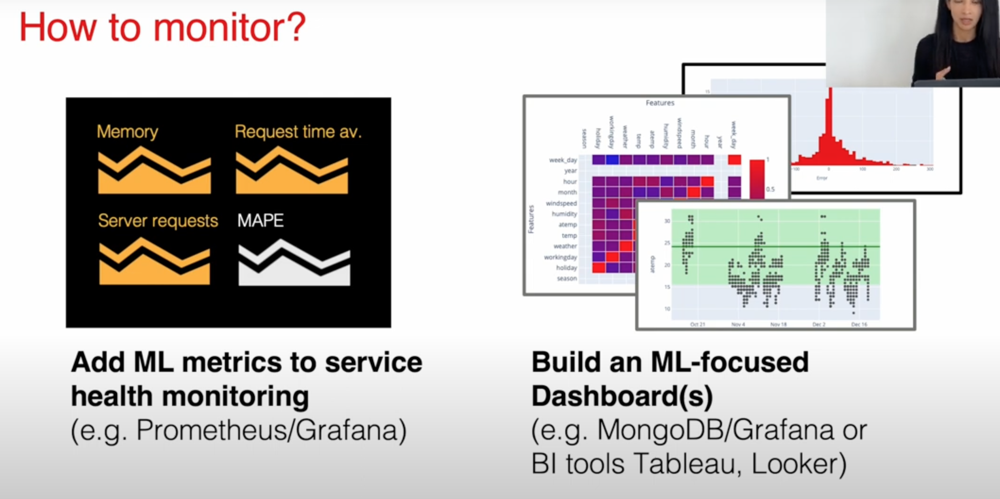
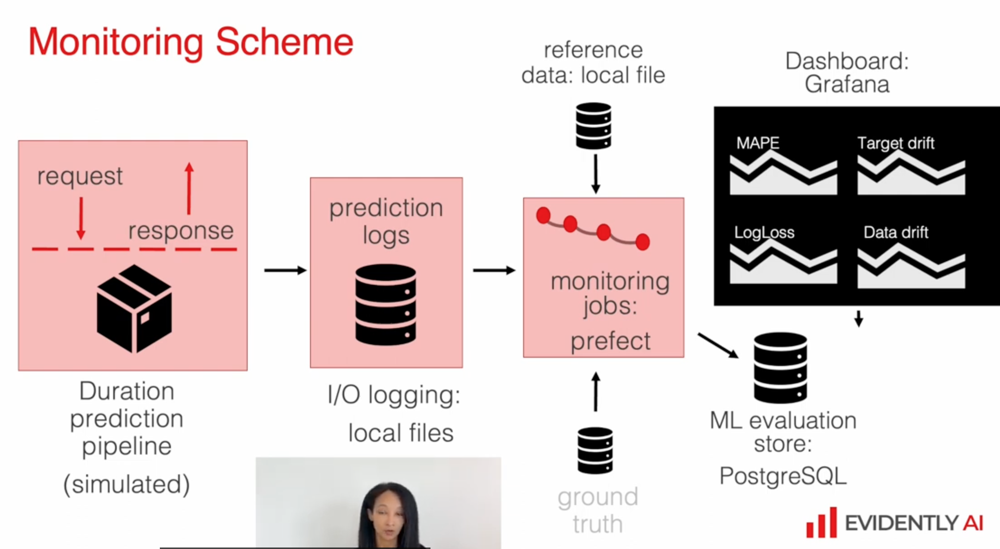

# 5.1 Intro to ML monitoring
## what we cares:
- service health
- model perofrmance
- data quality and integrity
- data and concept drift

## How to monitor
reuse the exisintg monioring system


Batch models with non-batch models
- batch model monitoring based on training data or past batch
- non-btach can pick some window function

monitoring schema:


# 5.2 Environment setup
create VE with python 3.11
build the docker compose:
```bash
docker-compose up --build
```

related link:
[Notes](https://github.com/fonsecagabriella/ml_ops/blob/main/05_monitoring/__notes.md)
[MLOps course page](https://github.com/DataTalksClub/mlops-zoomcamp/blob/main/05-monitoring/README.md)