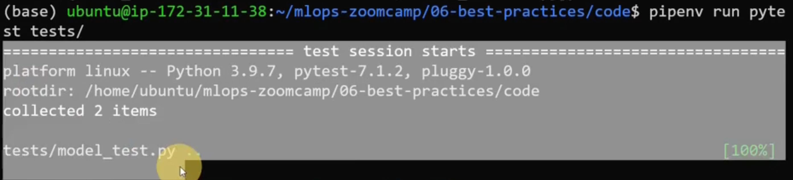
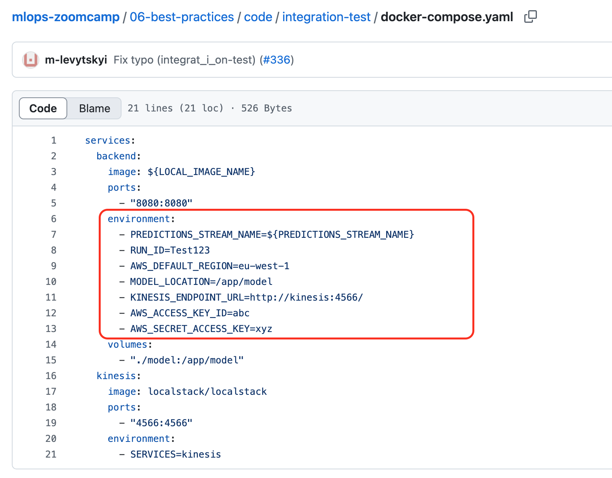
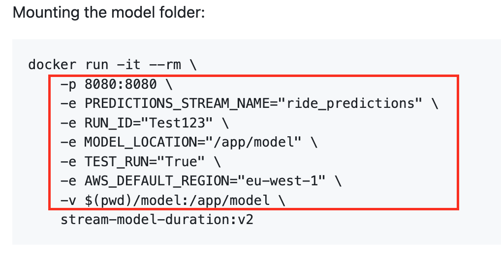
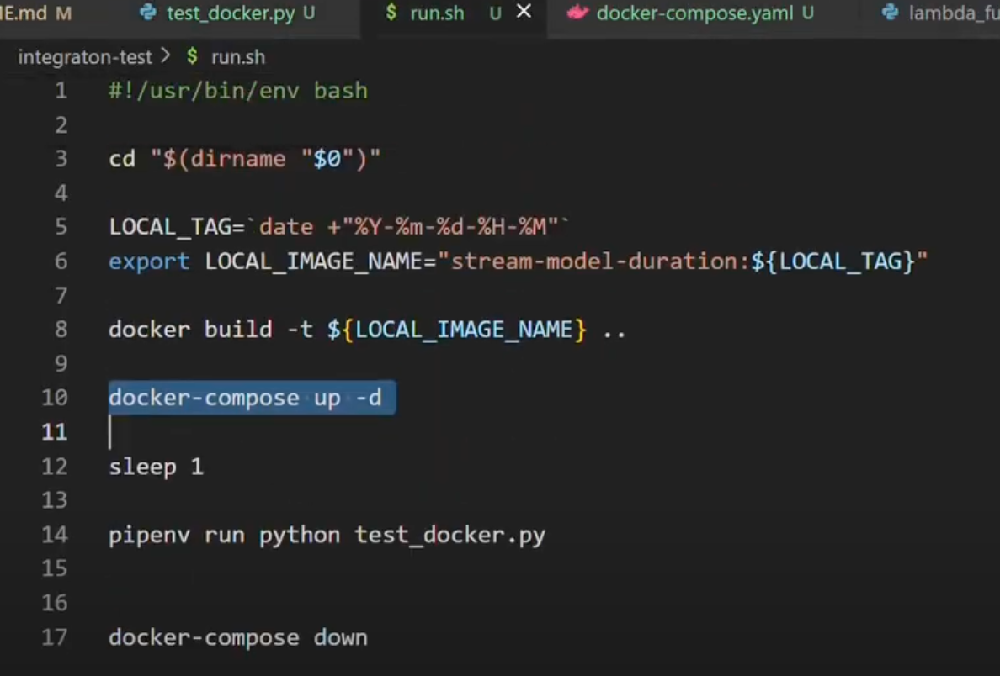
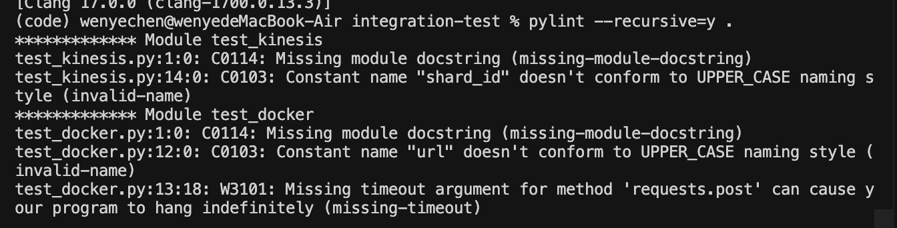
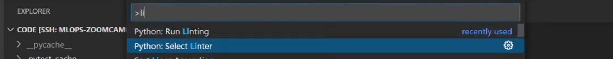
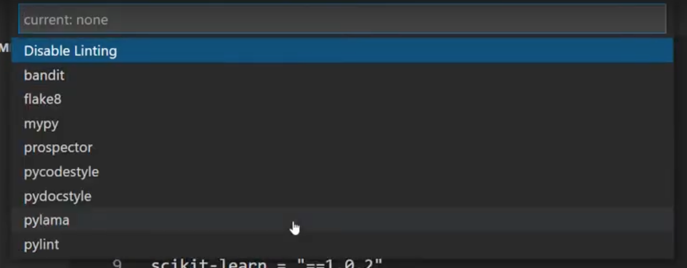
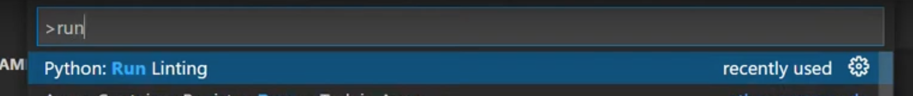

# 6.1 Test Python code with pytest
1. run test in vscode

2. run test in command line

```basg
pipenv run pytest tests/
```


# 6.2 Integration tests with docker-compose

step 1: docker build \
step 2: docker run \
step 3: run test_docker.py

To automately run these steps, create run.sh for automation. And config the docker settings in docker-compose.yaml




run.sh first version


command to start the integration test
```bash
.\run.sh
```

# 6.3 Testing cloud services with LocalStack

# 6.4 Code quality: linting and formatting
[PEP 8 – Style Guide for Python Code](https://peps.python.org/pep-0008/)

1. pylint library
  
  ```bash
  pylint --recursive=y .
  ```
  

  or using VS code

  
  
  

  You can disable the warnings using .pylintrc or pyproject.toml (Modern Python project configuration file)

2. black library
   
    black take care of formatting

    Note: black and isort change of files, ensure you are commit before using it

    ```bash
    black .
    ```

    or using below command, which only show the changes, but not do actual code changes

    ```bash
    black --diff . | less
    ```

3. isort library

   isort take care of import

   ```bash
    isort --diff . | less
    ```

    ```bash
    isort .
    ```

# 6.5 Git pre-commit hooks

1. pre-commit 
