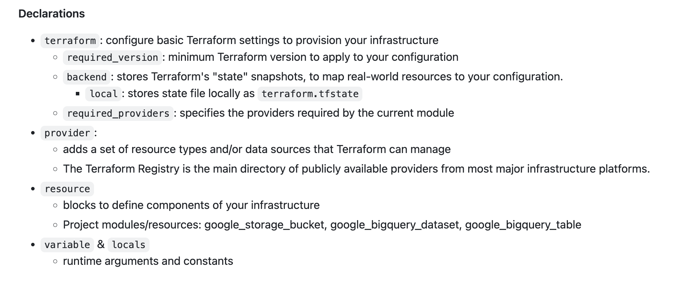

# 6B.1 Terraform - Introduction


[Terraform overview](https://github.com/DataTalksClub/data-engineering-zoomcamp/blob/main/01-docker-terraform/1_terraform_gcp/1_terraform_overview.md)



[Another doc](https://github.com/DataTalksClub/mlops-zoomcamp/blob/main/06-best-practices/docs.md#concepts-of-iac-and-terraform)

```bash
terraform init
```

```bash
terraform plan
```

```bash
terraform fmt
```

```bash
terraform apply
```

```bash
terraform destroy
```
